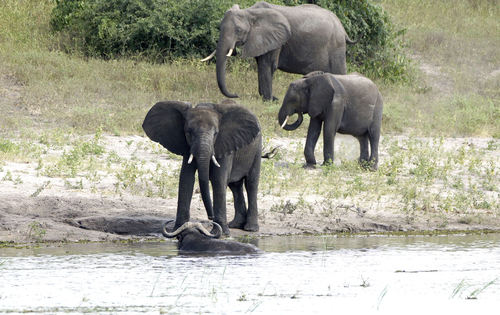

# Animal Detector

This repository serves 3 purposes: 
1. Download the raw observation images from iNaturalist observations. 
2. Execute Mega-detector object detection to identify individual animal instances
3. Crop Mega-detector animal instanced into sub-images
4. Arrange each sub-image into a taxonomic directory structure. 

### 1. Download Observations
The `raw_data_access.py` file is responsible for raw image downloads. 
Please perform the following steps to download the raw images for an iNaturalist observations CSV file.

1. Load the `observations.csv` file into the `observations/` directory. 
    - In this case, it is the `proboscidia_train.csv` file. This file is available at a public Dataset: [https://www.kaggle.com/datasets/travisdaws/spatiotemporal-wildlife-dataset](https://www.kaggle.com/datasets/travisdaws/spatiotemporal-wildlife-dataset)
2. Specify the name of the observation file on line 90.
3. Execute the file. The progress bar will update you on the status of the download.

### 2. Mega-detector Animal Detection
This process makes use of [Mega-detector](https://github.com/microsoft/CameraTraps/blob/main/megadetector.md) 
to detect and place bounding boxes around individual animal instances within a raw image. 
The bounding boxes, serve as the boundaries around which the images are cropped to produce sub-images per observation. 
A certainty of 75% is enforced for each animal detection. 
Each sub-image has the naming format: <Observation id>_<sub_image_char>.png
where <sub_image_char> is a letter of the alphabet corresponding to the number of sub-images already extracted.

Please note that Mega-detector is capable of detecting animals, vehicles, and humans. In this case we only extract the sub-image
if it is the type animal.

Please perform the following steps: 
1. Download the [MDvA5](https://github.com/ecologize/CameraTraps/releases/download/v5.0/md_v5a.0.0.pt) file to your computer. 
    - It must be saved in the following directory: `megadetector/` at you home folder.
2. Clone the following repositories into the project. These will replace the empty directories in the project: 
   ```angular2html
   git clone https://github.com/ecologize/yolov5/
   git clone https://github.com/ecologize/CameraTraps
   git clone https://github.com/Microsoft/ai4eutils
   ```

3. Navigate into the `CameraTraps` directory and execute the following
    - Remove the `opencv=4.5.5` in the `envs/environment-detector.yml`
    - `conda env create --file envs/environment-detector.yml`
4. Activate the virtual environment:
   - `conda activate cameratraps-detector`
5. Add additional package
   - `pip install ultralytics`
6. Add the packages to your Python path: 
   ```angular2html
   export PYTHONPATH="$PYTHONPATH:$HOME/path/to/Animal-Detector/CameraTraps:$HOME/path/to/Animal-Detector/ai4eutils:$HOME/path/to/Animal-Detector/yolov5"
   ```
   Please see the below example:
   ```angular2html
   export PYTHONPATH="$PYTHONPATH:$HOME/Desktop/git_store/Animal-Detector/CameraTraps:$HOME/Desktop/git_store/Animal-Detector/ai4eutils:$HOME/Desktop/git_store/Animal-Detector/yolov5"
   ```
7. Check Mega-detector.
   - Navigate into the `CameraTraps` directory.
   - Run the following script to check Mega-detectors output on a single image of your choice: 
   ```angular2html
   python detection\run_detector.py "c:\megadetector\md_v5a.0.0.pt" --image_file "some_image_file.jpg" --threshold 0.1
   ```
   
   This should produce a file in the same location with the format <name>_detections.jpg.
   This file will contain the bounding-box drawn on image an animal, vehicle or person was detected.
8. To run a batch detection on the `dataimages/raw/` directory perform the following: 
   - Create a file in the project root called `bounding_boxes.json`
   - Execute the following from terminal. Make sure you are in the `CameraTraps` directory
   ```angular2html
   python detection/run_detector_batch.py "$HOME/megadetector/md_v5a.0.0.pt" "$HOME/path/to/Animal-Detector/data/images/raw/" "$HOME/Desktop/git_store/Animal-Detector/bounding_boxes.json" --threshold 0.85 --output_relative_filenames --recursive --checkpoint_frequency 10000
   ```
   
   An example is below:
   ```angular2html
   python detection/run_detector_batch.py "$HOME/megadetector/md_v5a.0.0.pt" "$HOME/Desktop/git_store/Animal-Detector/data/images/raw/" "$HOME/Desktop/git_store/Animal-Detector/bounding_boxes.json" --threshold 0.85 --output_relative_filenames --recursive --checkpoint_frequency 10000
   ```
   
   The object identification labels, and bounding box dimensions are written to the `bounding_boxes.json` file.

Please note, when wanting to use the Mega-detector functionality, steps 4 and 5 must be repeated.

#### Example Mega-detector Use




### 3. Create Sub-images
