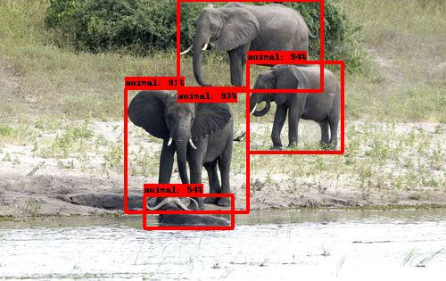

# Animal Detector

This repository serves 4 purposes arranged in sequential steps: 
1. Download the raw observation images from iNaturalist observations. 
2. Execute Mega-detector object detection to identify individual animal instances
3. Crop Mega-detector animal instanced into sub-images
4. Arrange each sub-image into a taxonomic directory structure. 

### 1. Download Observations
The `raw_data_access.py` file is responsible for raw image downloads. 
Please perform the following steps to download the raw images for an iNaturalist observations CSV file.

1. Load the `observations.csv` file into the `observations/` directory. 
    - In this case, it is the `proboscidia_train.csv` file. This file is available at a public Dataset: [https://www.kaggle.com/datasets/travisdaws/spatiotemporal-wildlife-dataset](https://www.kaggle.com/datasets/travisdaws/spatiotemporal-wildlife-dataset)
2. Specify the name of the observation file on line 90.
3. Execute the file. The progress bar will update you on the status of the download.

### 2. Mega-detector Animal Detection
This process makes use of [Mega-detector](https://github.com/microsoft/CameraTraps/blob/main/megadetector.md).
The below documentation is based off the provided instructions in the [Mega-detector](https://github.com/microsoft/CameraTraps/blob/main/megadetector.md) README file.
To detect and place bounding boxes around individual animal instances within a raw image. 
The bounding boxes, serve as the boundaries around which the images are cropped to produce sub-images per observation. 
A certainty of 75% is enforced for each animal detection. 
Each sub-image has the naming format: <Observation id>_<sub_image_char>.png
where <sub_image_char> is a letter of the alphabet corresponding to the number of sub-images already extracted.

Please note that Mega-detector is capable of detecting animals, vehicles, and humans. In this case we only extract the sub-image
if it is the type animal.

Please perform the following steps: 
1. Download the [MDvA5](https://github.com/ecologize/CameraTraps/releases/download/v5.0/md_v5a.0.0.pt) file to your computer. 
    - It must be saved in the following directory: `megadetector/` at you home folder.
2. Clone the following repositories into the project. These will replace the empty directories in the project: 
   ```angular2html
   git clone https://github.com/ecologize/yolov5/
   git clone https://github.com/ecologize/CameraTraps
   git clone https://github.com/Microsoft/ai4eutils
   ```

3. Navigate into the `CameraTraps` directory and execute the following
    - Remove the `opencv=4.5.5` in the `envs/environment-detector.yml`
    - `conda env create --file envs/environment-detector.yml`
4. Activate the virtual environment:
   - `conda activate cameratraps-detector`
5. Add additional package
   - `pip install ultralytics`
6. Add the packages to your Python path: 
   ```angular2html
   export PYTHONPATH="$PYTHONPATH:$HOME/path/to/Animal-Detector/CameraTraps:$HOME/path/to/Animal-Detector/ai4eutils:$HOME/path/to/Animal-Detector/yolov5"
   ```
   Please see the below example:
   ```angular2html
   export PYTHONPATH="$PYTHONPATH:$HOME/Desktop/git_store/Animal-Detector/CameraTraps:$HOME/Desktop/git_store/Animal-Detector/ai4eutils:$HOME/Desktop/git_store/Animal-Detector/yolov5"
   ```
7. Check Mega-detector.
   - Navigate into the `CameraTraps` directory.
   - Run the following script to check Mega-detectors output on a single image of your choice: 
   ```angular2html
   python detection\run_detector.py "c:\megadetector\md_v5a.0.0.pt" --image_file "some_image_file.jpg" --threshold 0.1
   ```
   
   This should produce a file in the same location with the format <name>_detections.jpg.
   This file will contain the bounding-box drawn on image an animal, vehicle or person was detected.
8. To run a batch detection on the `dataimages/raw/` directory perform the following: 
   - Create a file in the project root called `bounding_boxes.json`
   - Execute the following from terminal. Make sure you are in the `CameraTraps` directory
   ```angular2html
   python detection/run_detector_batch.py "$HOME/megadetector/md_v5a.0.0.pt" "$HOME/path/to/Animal-Detector/data/images/raw/" "$HOME/Desktop/git_store/Animal-Detector/bounding_boxes.json" --threshold 0.85 --output_relative_filenames --recursive --checkpoint_frequency 10000
   ```
   
   An example is below:
   ```angular2html
   python detection/run_detector_batch.py "$HOME/megadetector/md_v5a.0.0.pt" "$HOME/Desktop/git_store/Animal-Detector/data/images/raw/" "$HOME/Desktop/git_store/Animal-Detector/bounding_boxes.json" --threshold 0.85 --output_relative_filenames --recursive --checkpoint_frequency 10000
   ```
   
   The object identification labels, and bounding box dimensions are written to the `bounding_boxes.json` file.

Please note, when wanting to use the Mega-detector functionality, steps 4 and 5 must be repeated.

#### Example Mega-detector Use




### 3. Create Sub-images
The `detection_cropping.py` file is responsible for performing the sub-image cropping process.
The process makes use of the `bounding_boxes.json` file containing all Mega-detector detections.
The process, converts the provided bounding boxes for the _animal_ category into coordinates within the image. 
The images is cropped based on these coordinates. The cropping reduces image resolution. 
To combat the loss of resolution Lanzos interpolation and edge sharpening kernels were used to enhance the resulting
sub-image. 

Please perform the following steps to crop the images according to the Mega-detector object detections. 
1. Ensure steps 1 and 2 are completed and the results are in the specified directories. 
2. Simply run the script. 
   - The resulting cropped images will be placed within the `images/cropped/` directory.


### 4. Taxonomic Directory Structure
This final step places the sub-images into a directory that mimics the taxonomic structure of the dataset. 
This taxonomic structure enables the use of the keras [`image_dataset_from_directory()`](https://www.tensorflow.org/api_docs/python/tf/keras/utils/image_dataset_from_directory) method 
in the [Wildlife Classification](https://github.com/Spatiotemporal-Wildlife-Classification/Wildlife-Classification)
repository. This enables automated image dataset construction and label inference based on the directory structure.
The images are split into training and validation sets. The validation set comprises 15% of the available data.

To create the taxonomic directory structure please follow the below steps:
1. Ensure steps 1-3 are completed and have produced the expected results.
2. Specify the dataset names on line 174. These datasets are what the dataset taxonomic structure is based on.
   - Note the names can also be specified one at a time. The result will be the same.
3. Execute the script. 
   - The output will be in the `images/taxon_structured/` directory.

The output of this step is used to train the image classification models in the [Wildlife Classification](https://github.com/Spatiotemporal-Wildlife-Classification/Wildlife-Classification) repository.
The documentation for this Repository is available at: https://spatiotemporal-wildlife-classification.github.io/Wildlife-Classification/